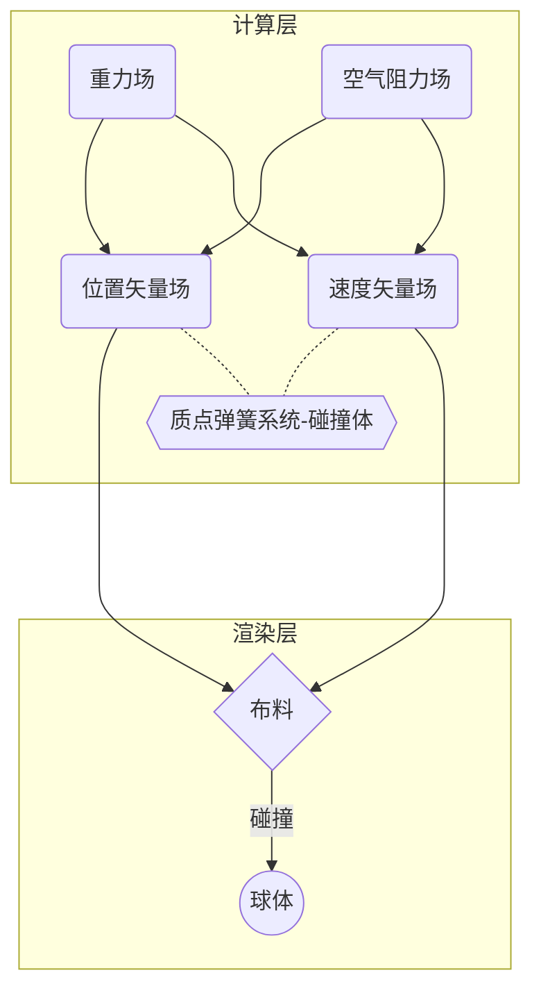

# 质点弹簧系统布料模拟

# ——基于半隐式Euler方法和Verlet方法的图形学数值仿真

---

==PB21050988杜朋澈==

## INDEX

[TOC]

## 背景简介

### 布料模拟

布料模拟是计算机图形学中的一个重要研究领域，它旨在用数学和物理模型来模拟现实中布料的运动和形变。布料模拟有很多应用场景，例如游戏设计、服装设计、虚拟人物设计、电影特效等。

布料模拟的基本原理可以分为以下几个方面：

- **布料结构的建立**：这一步是将现实中的布料用一些简化的数据结构来表示，通常是用一个二维网格来表示布料的表面，网格上的每个顶点都是一个质点，质点之间用弹簧来连接，表示布料的内部力。不同方向和距离的弹簧可以表示不同的物理特性，例如拉伸、弯曲、剪切等。
- **牛顿运动定律的应用**：这一步是根据牛顿力学的基本定律，计算每个质点受到的合力，从而得到每个质点的加速度、速度和位置。合力包括外力和内力，外力可以是重力、风力、摩擦力等，内力则是由弹簧产生的恢复力。为了计算每个质点的位置，需要用一些数值积分方法，例如欧拉法、Verlet法等。
- **布料与碰撞体的碰撞**：这一步是检测并处理布料与其他物体（例如胶囊体、球体等）或者自身（例如折叠、缠绕等）之间的碰撞。碰撞检测可以用一些简单的几何判断或者连续碰撞检测方法来实现。碰撞响应则是根据碰撞法向量和反弹系数来调整质点的位置和速度，使得布料不会穿透或者卡住其他物体。

## 理论基础

### 质点弹簧系统

​	质点弹簧系统（Mass-Spring System）是一种常用的布料模拟方法，它将布料的表面用一个二维网格来表示，网格上的每个顶点都是一个质点，质点之间用弹簧来连接，表示布料的内部力。质点弹簧系统可以模拟布料的运动和形变，根据牛顿运动定律，计算每个质点受到的合力，从而得到每个质点的加速度、速度和位置。合力包括外力和内力，外力可以是重力、风力、摩擦力等，内力则是由弹簧产生的恢复力。

​	质点弹簧系统的弹簧可以分为三种类型：

- 结构弹簧（Structure Spring）：连接紧密相邻的横向和纵向质点，提供薄膜的拉伸刚度，固定整体结构；

- 剪切弹簧（Shear Spring）：连接在同一对角线上的相邻质点，模拟薄膜倾斜方向的作用力，防止剪切变形错位等；

- 弯曲弹簧（Bending Spring）：连接横向和纵向隔一个质点的两质点，提供弯曲刚度，薄膜折叠时弯折边缘圆滑。

  

  结构弹簧的作用是为了保持质点之间的初始距离，用于防止在经纬二个方向有过度变形；剪切弹簧是为了模拟织物倾斜方向的作用力；弯曲弹簧是为了避免织物发生过度翻折。

  

> 质点弹簧系统中，一般只考虑相邻的质点之间存在弹簧，或者隔一个质点的邻接质点之间存在弹簧。这样可以减少计算量和复杂度，也可以保持布料的基本特性。如果任意两个质点之间都视为存在一个弹簧，那么布料会变得非常僵硬和不自然。

### 数值积分

数值积分是用于求定积分的近似值的一种方法。在数学分析中，有很多计算给定函数的定积分是不可行的，而数值积分是利用黎曼积分等数学定义，用数值逼近的方法近似计算给定的定积分值。借助计算机和编程，数值积分可以快速而有效地计算复杂的积分。

#### Euler方法

欧拉方法是一种数值积分方法，又称为欧拉折线法，是用折线来逼近曲线的一种方法。

为了从几何角度理解欧拉方法，考虑计算这样的一个未知曲线的形状：它具有给定的起点并且满足一个给定的微分方程。**注意此处的“微分方程”可以看作能够通过曲线上任意点的位置而计算出这一点的切线斜率的公式。**

欧拉方法的思路是，通过曲线起点和微分方程计算出起点处的斜率，从而得到切线，顺着切线前进得到下一个点，依此类推，便可计算出一条折线。一般情况下，这条折线与原先的未知曲线偏离不远，并且任意小的误差都可以通过减少步长来得到。

欧拉方法的一般形式如下，对一般的微分方程：
$$
y'(t) = f(t, y(t))
$$

我们希望用 $y$ 在点 $(t_0,y(t_0))$ 附近的线性近似来得到其近似解，利用时间 $t_n$ 时的数值，可得到时间 $t_{n+1}=t_n+h$时的近似值如下：
$$
y_{n+1} = y_n+hf(t_n,y_n)
$$
$h$ 即为步长，在步长较小时，欧拉方法的误差也很小。

#### Verlet方法

Verlet方法是另一种求解离散时间上的积分的方法。

Verlet方法的一般形式如下，考虑函数$f(t+h)$和$f(t-h)$分别在$t$处的展开，有：
$$
f(t+h)=f(t) + f'(t)h + \frac{1}{2}f''(t)h^2 + \frac{1}{6}f'''(t)h^3 + O(h^4)
\\
f(t-h)=f(t) - f'(t)h + \frac{1}{2}f''(t)h^2 - \frac{1}{6}f'''(t)h^3 + O(h^4)
$$
整理可得：
$$
f(t+h)=2f(t)-f(t-h)+h^2f''(t)+O(h^4)
$$

### 受力分析

- **弹簧弹力**

  由胡克定律，易得$\vec{x_b}$处质点对$\vec{x_a}$处的质点的弹力为：

$$
F(x_a)_{s} = -k_s \frac{\vec{x_a}-\vec{x_b}}{|\vec{x_a}-\vec{x_b}|}(|\vec{x_a}-\vec{x_b}|-l)
$$

- **弹簧阻尼**

  阻尼是用来衡量系统自身消耗振动能量能力的物理量，在运动过程中，阻尼器的阻尼力总是与弹簧块的运动方向相反，如下式所示：

$$
f(x_a)_{d} = -k_d \frac{\vec{x_a}-\vec{x_b}}{|\vec{x_a}-\vec{x_b}|}(\vec{v_a} - \vec{v_b})· \frac{\vec{x_a}-\vec{x_b}}{|\vec{x_a}-\vec{x_b}|}
$$

  确定上述信息后，利用**半隐式欧拉方法（semi-implicit Euler method）**对质点弹簧系统的运动状态进行推导得到：
$$
\begin{cases}
f_t = \sum^n_{b=0}F(x_a)_s + \sum^n_{b=0}f(x_a)_d
\\v_{t+dt} = v_t + dt · \frac{f_t}{m}
\\x_{t+dt} = x_t + dt · v_{t+dt}
\end{cases}
$$

  或是利用 **Velocity Verlet方法**进行推导可得到：
$$
\begin{cases}
f_t = \sum^n_{b=0}F(x_a)_s + \sum^n_{b=0}f(x_a)_d
\\v_{t+dt} = v_t + dt · \frac{\frac{f_t}{m}+\frac{f_{t+dt}}{m}}{2}
\\x_{t+dt} = x_t + dt · v_{t} + \frac{1}{2}\frac{f_t}{m}(dt)^2
\end{cases}
$$

> 由Verlet方法推导出Velocity Verlet方法的证明过程较为复杂，此处暂不介绍，具体证明可见 Wiki：Verlet Integration

- **空气阻力**

  不论是什么方法、几阶精度，都会有相应的误差，而误差的累计可以导致整个系统崩溃。空气阻尼可以在一定程度上缓解这一点：对每个质点在其速度相反方向施加一个微小的空气阻力。

  

## 代码实现

### 程序框架

本文选用Taichi框架作为唯一的外部库。Taichi是一种**开源的高性能并行计算框架**，它语法简单，上手容易，可以大大简化高性能图形学、数值计算、人工智能应用方面的开发。

Taichi在与多种 Python 生态的科学计算库兼容的同时，还具备以下这些优点：

- 使用即时编译（JIT）的技术，将taichi代码转换为底层硬件的指令，而不是解释执行。这样可以避免解释器的开销，提高运行速度。
- 使用并行计算（parallel computing）的技术，将计算任务分配到多个处理器或者核心上，同时执行。这样可以充分利用硬件资源，提高效率。
- 使用了向量化（vectorization）的技术，将多个数据打包成一个向量，一次性进行计算。这样可以减少内存访问次数，提高吞吐量。
- 使用了编译优化（compilation optimization）的技术，对taichi代码进行分析和变换，消除冗余和无效的操作，提高性能。

### 算法设计

本文的布料模拟程序模拟一块正方形布料掉落在刚性球体上的物理行为，并对比不同体量的质点弹簧系统和不同渲染方式下的表现差异。

### 运行结果

> **动态模拟截图较为困难，且 Taichi 1.6.0 的 GGUI 暂不支持导出gif图，故此处运行结果来自网络**
>
> 实际运行结果可直接运行 python 程序查看：
>
> - 按键"Q"退出程序
> - 按键"C"显示质点弹簧骨架
>
> - 按键"Y""U""I""O"切换至不同模拟精度的布料

## 心得体会

嵌入 Python 的 Taichi 框架提供了独特的 Taichi 内核，使得 Python 源码可以直接与底层硬件通信，弥补了原生 Python 运行效率方面的不足，在图形学模拟方面展现出接近甚至超越 C++ 和 CUDA 的性能，并且大大简化了图形学模拟的开发难度。

然而 Taichi 作为一种诞生时间并不长的开源框架，其向后兼容性非常差。新版本的框架几乎不可能兼容老版本的 Taichi 程序，而且最新的可视化界面 GGUI 几乎将原来 GUI 的 API 全部推倒重做，让我在查阅文档时遇到了很大困难。

> 源代码已托管在 Github @Archer_du
>
> 本程序预留了很多客制化参数，在模拟情景和性能调优方面仍然有很大的拓展空间，感兴趣的同学可以clone源码自行修改

## 参考文献

[1] [基于C++实现弹簧质点系统](https://zhuanlan.zhihu.com/p/359837453)

[2] [从零开始学图形学：弹簧质点系统——Euler Method和Verlet Integration]([从零开始学图形学：弹簧质点系统——Euler Method和Verlet Integration - 知乎 (zhihu.com)](https://zhuanlan.zhihu.com/p/355170943))

[3] Python科学计算基础——罗奇鸣

## 讲解日期

6月29日
